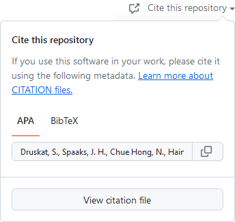

---
toc:
  toc_depth: 0
---

!!! faq "Question"

    ## What is CFF's relation with GitHub? Is CFF a GitHub format?
    
    The Citation File Format project is a **completely independent and open community project**.

    **GitHub are a user of the Citation File Format.**
    Specifically, they use the [`ruby-cff`](https://github.com/citation-file-format/ruby-cff) library to render citation information
    provided as a `CITATION.cff` file in a GitHub repository
    in the citation widget you can see on the repository page (example below).

    